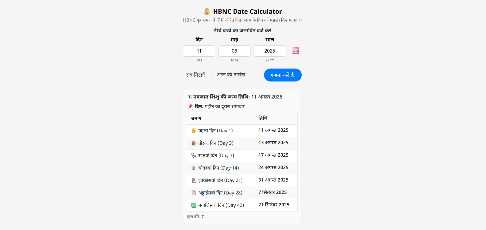

# 👼 HBNC Date Calculator

**Home Based Newborn Care (HBNC) – Date Calculator**  
यह टूल नवजात शिशु के जन्मदिन के आधार पर **HBNC के 7 निर्धारित गृह भ्रमण तिथियाँ** स्वचालित रूप से निकालता है।  
जन्म के दिन को **पहला दिन** मानकर आगे के सभी विज़िट की तिथियां दिखाई जाती हैं।

## 📦 लाइव डेमो

> आप इस टूल को [यहाँ लाइव](https://sudheerfy.github.io/HBNC-Date-Calculator) देख सकते हैं।

## ✨ Features

- 📅 **दिन, माह और साल से DOB इनपुट** या **कैलेंडर पिकर** से चयन  
- 🗓 **HBNC के 7 गृह भ्रमण दिन** स्वतः गणना  
- 🔢 हिंदी और अंग्रेज़ी दोनों में विज़िट डे लेबल  
- 🧮 **जन्मदिन का सप्ताह का क्रम** (जैसे "महीने का पहला सोमवार")  
- ⚡ तेज़ और मोबाइल-फ्रेंडली डिज़ाइन  
- ✅ इनपुट वेलिडेशन और एरर हैंडलिंग (ग़लत तारीख़ पर चेतावनी)  
- 🎯 "आज की तारीख़" और "सब मिटाएँ" बटन

## 📷 Screenshot



## 📋 How to Use

1. **बच्चे का जन्मदिन दर्ज करें** (दिन, माह, साल)  
   या **कैलेंडर आइकन** से तारीख़ चुनें।
2. **"गणना करें"** बटन दबाएँ।
3. नीचे HBNC के सभी विज़िट दिन और तारीखें देखिए।

## 📅 HBNC Visit Schedule

| Visit Day | Hindi Label | Offset from DOB | Icon |
|-----------|-------------|-----------------|------|
| Day 1     | पहला दिन    | 0 days          | 👶   |
| Day 3     | तीसरा दिन  | +2 days         | 🏠   |
| Day 7     | सातवां दिन | +6 days         | 🩺   |
| Day 14    | चौदहवां दिन | +13 days        | 👩‍⚕️ |
| Day 21    | इक्कीसवां दिन | +20 days     | 🏥   |
| Day 28    | अट्ठाईसवां दिन | +27 days    | 📋   |
| Day 42    | बयालिसवां दिन | +41 days    | ✅   |

## 🛠 Installation / Run Locally

You can run it directly in a browser without any server setup.

1. Clone this repo:
   ```bash
   git clone https://github.com/sudheerfy/hbnc-date-calculator.git
   ```

## 📄 License

This project is licensed under the MIT License — you can freely use and modify it.

## 🙌 Credits

- Developed by Sudheer Singh
- Powered by jQuery & jQuery UI

यदि आपको यह टूल उपयोगी लगा, तो इसे स्टार ⭐ जरूर करें!   
